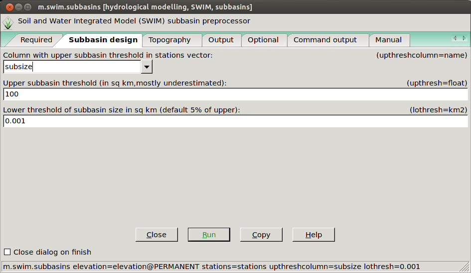
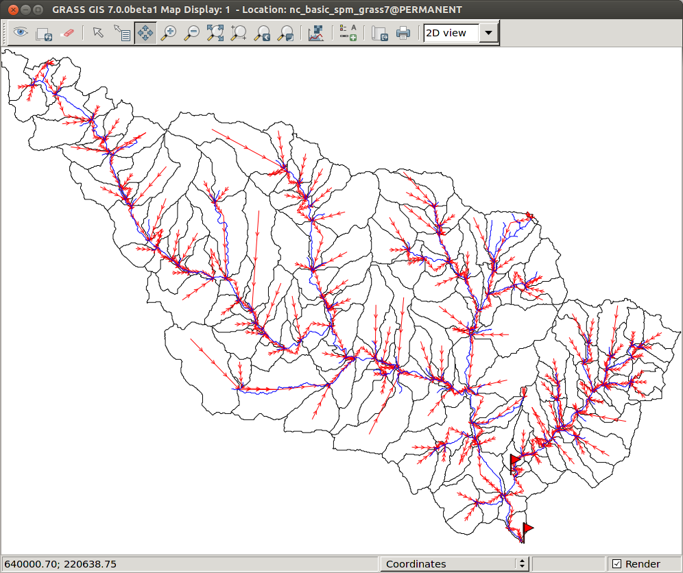
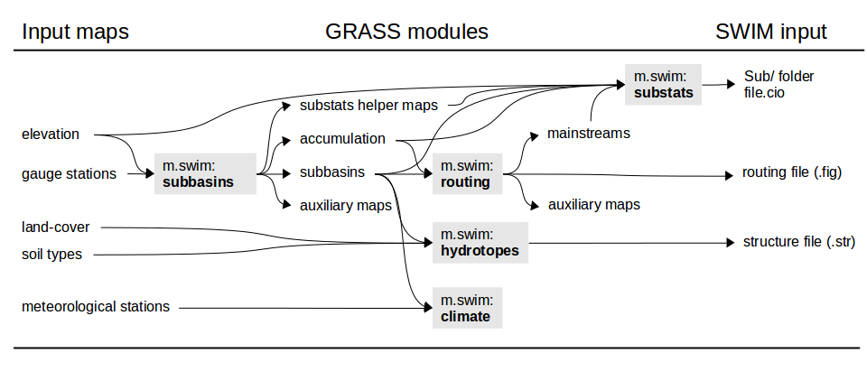

 The m.swim.\* modules
=======================================================

## Download and installation
### Linux/Mac
The code is hosted both at [PIK's GitLab](https://gitlab.pik-potsdam.de/wortmann/m.swim) and mirrored on [Github](https://github.com/mwort/m.swim). With GRASS >=7.2, install all modules via the build-in extension manager:
```
g.extension m.swim url=https://github.com/mwort/m.swim
```

For GRASS versions <7.2, download the modules and install them using "make" in an active GRASS session.
The source code can also be cloned from either repository and then installed locally using g.extension like this:
```
git clone git@gitlab.pik-potsdam.de:wortmann/m.swim.git
g.extension m.swim url=path/to/m.swim/directory
```
The modules can also be manually installed or used as python scripts if all things (i.e. g.extension) fail.

### Windows
Download the repository and use the modules as python scripts. This is because
the standard Make add on compilation including the `g.extension url=<path>`
argument doesn't work under Windows.

## Contributing, developing and debugging
PIK cluster users can use the git repository on the cluster to make changes to the m.swim.\* code. Here is a quick [HOWTO](developing_debugging.md).

## Using the GUI
The m.swim.\* modules (like any other GRASS module) can be either used as a script command or to open a GUI widget. On the GRASS command line, type the following to open them:
```
m.swim.subbasins &
m.swim.hydrotopes &
m.swim.routing &
m.swim.substats &
```
If you want to also set arguments on the command line and still open the GUI, just add a --ui flag. E.g.:
```
m.swim.subbasin elevation=elevation@PERMANENT stations=stations upthresh=2 --ui &
```
Here are some screenshots of the GUI:


The m.swim.subbasins GUI in the subbasin design tab.



The routing network (red) plotted with the subbasins (black) and the mainstreams (blue).

More screenshots:
- [m.swim.routing GUI](img/routing_screenshot.png)
- [subbasin table](img/subbasin_table_screenshot.png)
- [m.swim.substats GUI](img/substats_screenshot.png)
- [help page](img/help_screenshot.png)

To view your output you will have to open the GRASS wxPython GUI if you havent already done so. Here is the manual: [GRASS70 GUI](http://grass.osgeo.org/grass70/manuals/wxGUI.html)

## Help pages

All GRASS manuals come with a manual page as the last tab in the GUI or you can find them here:

- [m.swim.subbasins](m.swim.subbasins.md)
- [m.swim.hydrotopes](m.swim.hydrotopes.md)
- [m.swim.routing](m.swim.routing.md)
- [m.swim.substats](m.swim.substats.md)

## Prerequisits
-   the DEM must be slightly larger then the entire topographical catchment, by one cell in each direction to be precise. Using a precut DEM is therefore not advisable, but this can be overcome by adding an 'a' to the rwatershedflags in the m.swim.subbasins (this might lead to errors later on though).
-   the stationthresh in the m.swim.subbasin module should be slightly smaller than the drainage area of the station with the smallest drainage area. If stations don't produce the expected catchment area, they are most likely not snapped to the appropriate stream. Moving these stations closer to the exact stream location will avoid this.
-   the location's database should be SQLite (check with `db.connect -p`)

## Workflow and map dependencies


## Setting up a SWIM project
Create a new mapset and set region:
```
g.mapset -c mapset=subbasins
g.region rast=elevation@PERMANENT
```

### Stations
Create a stations point vector map. E.g.:
```
echo "x|y|name|subbsize
640579|215607|outlet|0.1
640388|216617|headwater|0.05" > stations.dat
v.in.ascii input=stations.dat out=stations x=1 y=2 \
           columns='x int, y int, name varchar(20), subbsize double' skip=1
```
Or by using the `v.import` or `v.in.ogr` modules.

### Subbasins
Make simple subbasins (default output arguments):
```
m.swim.subbasins elevation=elevation@PERMANENT stations=stations \
                 upthresh=0.1 subbasins=subbasins
```
In addition to the subbasins vector and raster map, this also produces catchment raster and vector maps, accumulation, drainage, streams, slopesteepness and slopelength rasters (as needed by the subsequent m.swim.\* modules) by default.
Subbasins with varying subbasin thresholds and defined lower threshold:
```
m.swim.subbasins elevation=elevation@PERMANENT stations=stations \
                 upthreshcolumn=subbsize lothresh=0.001 subbasins=subbasins
```

### Hydrotopes

Calculate hydrotopes with the subbasins, landuse and soil raster maps:
```
m.swim.hydrotopes subbasins=subbasins landuse=landuse@PERMANENT \
                  soil=soils@PERMANENT strfilepath=mypro.str hydrotopes=hydrotopes
```
Alternatively, contours (either as interval or list of breaks through the `controus` argument; or as a raster map through the `contourrast` argument) and `more` maps can be used to further subdevide the hydrotopes:
```
m.swim.hydrotopes subbasins=subbasins landuse=landuse@PERMANENT \
                  soil=soils@PERMANENT more=geology@PERMANENT \
                  -c contours=50 elevation=elevation@PERMANENT \
                  strfilepath=Input/mypro.str
```
This implicitly creates a raster called contours and one called hydrotopes (as default names given for the `hydrotopes` and `contourrast` arguments).

### Routing

Calculate the routing structure, routing network and mainstreams (the output defaults are: `mainstreams=mainstreams, routingnet=routingnetwork, outlets=subbasinoutlets, inlets=subbasininlets`; which can also be set explicitly):
```
m.swim.routing subbasins=subbasins accumulation=accumulation
```
Or set the `-c` flag to include the centroids in the routing network:
```
m.swim.routing -c subbasins=subbasins accumulation=accumulation
```
Check routing structure and write SWIM routing file (the `--o` overwrite is necessary as the mainstreams are recreated):
```
m.swim.routing -r subbasins=subbasins figpath=mypro.fig --o
```
Both these steps can also be executed at once (but may result in an error if the there are too many outlets):
```
m.swim.routing subbasins=subbasins accumulation=accumulation \
               figpath=Input/mypro.fig
```

### Subbasin statistics

Create the subbasin statistics files in a Sub folder and the file.cio in the `projectpath` with all default input (`mainstreams, drainage, accumulation,  stp and sl` also have default values but included here to emphasise that they are needed as input):
```
m.swim.substats subbasins=subbasins projectname=mypro projectpath=. \
                elevation=elevation@PERMANENT mainstreams=mainstreams \
                drainage=drainage accumulation=accumulation \
                stp=slopesteepness sl=slopelength
```
When recalculating or changing parameters, the calculation can be accelerated by setting `chl, chs, chd, chw` explicitly:
```
m.swim.substats subbasins=subbasins projectname=mypro projectpath=. \
                elevation=elevation@PERMANENT delay=geology@PERMANENT \
                chl=mainChannelLength chs=mainChannelSlope \
                chd=channelDepth chw=channelWidth
```

### Additional files

The following files/folders are not written by any of the modules and will have to be copied into the `projdir` from elsewhere:
* input/
  * climate/clim1.dat
  * climate/clim2.dat
  * mypro.bsn
  * mypro.cod
  * runoff.dat
  * wstor.dat
  * crop.dat
  * cntab.dat
  * Soil/soil\*.dat
  * soil.cio
  * wgen.dat
* output/
  * Res/
  * GIS/
  * Flo/


## GRASS best practice

### Region

-   always double check the current region settings using `g.region -p`
-   save your default region by setting the region with the `-s` flag in the PERMANENT mapset. This allows you to easily revert to it using `g.region -d` and all new mapset you create are set to this region by default
-   create a raster (and vector) that defines your Region of Interest (ROI). This allows you to crop all imported maps to this or limit the computation to these cells by setting `r.mask ROI`

### Mapsets

-   create more mapsets rather then filling one or the PERMANENT mapset up with too many maps. Think of them as folders in your GRASS database and subdivide your work accordingly. The PERMANENT mapset should only hold the most basic maps you need to access a lot, e.g. elevation, ROI, country\_boundaries.

### Workflow

-   as GRASS' great strength is it's 'scriptability', make sure to 'save' the commands you used in a text file or shell script. Use the 'COPY' button in each command window to load the module's command into your cache and paste it. This will allow you to easily recreate your work later on and simultaneously provide a great manuscript for a potential 'Methods' article section ;)
-   make use of the help pages and manual each module comes with
